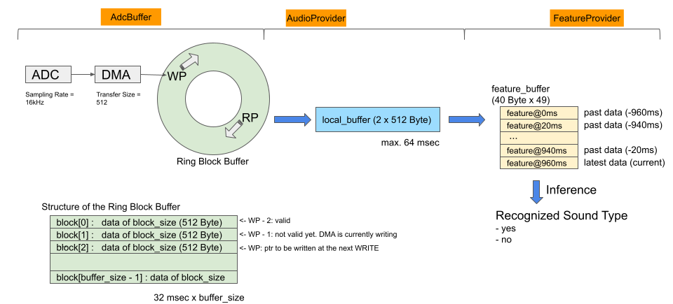
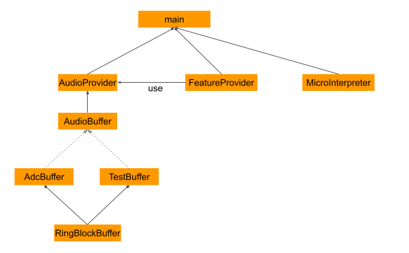

# About
- Simple project for micro_speech
    - Recognize "Yes" / "No"

- Raspberry Pi Pico
    - input = AdcBuffer. Default
    - input = TestBuffer (Voice of Yes)
    - input = Prepared feature data (Yes, No)
- PC ( for debugging )
    - input = TestBuffer (Voice of Yes). Default
    - input = Prepared feature data (Yes, No)

## Build
- Raspberry Pi Pico
    - Follow the steps in README (https://github.com/iwatake2222/pico-work )
    - You may need to change the project to be built and run, or use this commit ( de2704626c7118c5372a30daeb5f207308b88bce )
- PC ( for debugging )
    - Create a project using CMake in this directory
    - A project for Visual Studio 2019 was tested

## Design
### Dataflow

### Software Design

- AudioBuffer:
    - provides an interface to access storead audio data in ring block buffer
- RingBlockBuffer:
    - consists of some blocks. The block size is 512 Byte and the size is equals to DMA's transfer size
    - 512 Byte ( 32 msec @16kHz ) is also convenient to work with FeatureProvider which generates feature data for 30 msec of audio data
- AudioProvider:
    - extracts data from the ring block buffer to the local buffer for the requested time
    - converts data from uint8_t to int16_t
    - allocates the data on sequential memory address
        - the local buffer keeps the past data even after the data was read, because duration time to calculate feature is 30 msec but stride time is 20 msec. It means data for the last 10 msec is used at the next calculation
- FeatureProvider:
    - almost the same as the original code

## Performance
- Processing time:
    - Preprocess (retrieving audio data and creating feature data): 8 msec
    - Inference: 61 msec
- Stride for feature data is 20 msec, so 3 ~ 5 slices of feature are drops. It means 70 ~ 110 msec of input voice is missed. Still input voice to generate feature for each process is continuous.
- AudioProvider copies data onto local buffer and converts it from uint8_t to int16_t. It is redundant. However, preprocess time is smaller than inference time and by doing this, I don't need to modify the original code.
 
## Others
- Please read README ( https://github.com/iwatake2222/pico-work ) for other information
